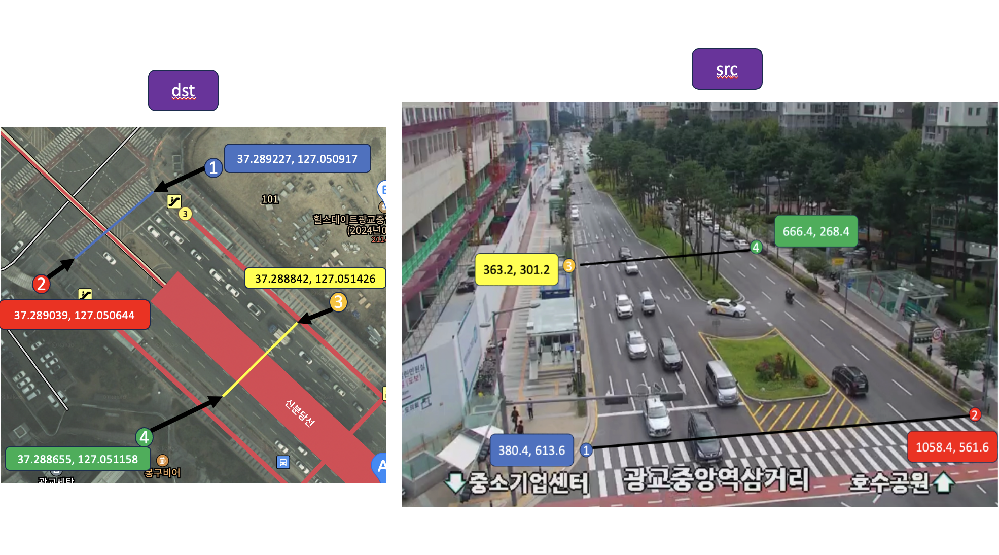

# Car-Speed-Estimation-using-YOLOv8
- YOLOv8 tracking을 이용하여 차량 속도 계산 프로젝트

## YOLOv8 Fine-Tunning
- Train Data: YOLOv8 custom dataset training을 위해서 - https://aihub.or.kr/aihubdata/data/view.do?currMenu=115&topMenu=100&aihubDataSe=realm&dataSetSn=165 와 https://www.aihub.or.kr/aihubdata/data/view.do?currMenu=&topMenu=&aihubDataSe=realm&dataSetSn=164 에서 데이터 확보 후 YOLOv8 fine-tunning 진행

- YOLOv8 custom dataset training을 위해서는 
``` 
# Train/val/test sets as 1) dir: path/to/imgs, 2) file: path/to/imgs.txt, or 3) list: [path/to/imgs1, path/to/imgs2, ..]
path: ../datasets/coco8  # dataset root dir
train: images/train  # train images (relative to 'path') 4 images
val: images/val  # val images (relative to 'path') 4 images
test:  # test images (optional)

# Classes (80 COCO classes)
names:
  0: person
  1: bicycle
  2: car
  ...
  77: teddy bear
  78: hair drier
  79: toothbrush
```
와 같은 ymal file 필요.

- label을 위한 txt file 생성: Labels for this format should be exported to YOLO format with one *.txt file per image. If there are no objects in an image, no *.txt file is required. The *.txt file should be formatted with one row per object in class x_center y_center width height format. Box coordinates must be in normalized xywh format (from 0 to 1). If your boxes are in pixels, you should divide x_center and width by image width, and y_center and height by image height. Class numbers should be zero-indexed (start with 0).

- trained model: ```best.pt```

## Test Data 선정
- Test Data: https://www.utic.go.kr/map/map.do?menu=cctv 에서 아주대학교 근처의 화각, 화질이 적당한 cctv 장소를 선정하였고 선정된 장소는 광교중앙역 삼거리


## Test Data의 첫 번째 프레임 캡쳐
- capture.py

## 캡쳐된 프레임에서 4개의 reference point 선정, perspective transform
</img>

- 위 그림과 같이 4개의 ref point 선정 후 perspective matrix 를 생성

- 속도 계산 코드: ```calculate_speed.py```
- 속도 계산 시 오차 보정을 위해 처음 4 프레임은 처음 계산된 속도만 출력하게 하였고, 이후는 평균 속력으로 계산함

## 결과
- ```sample_result.py```